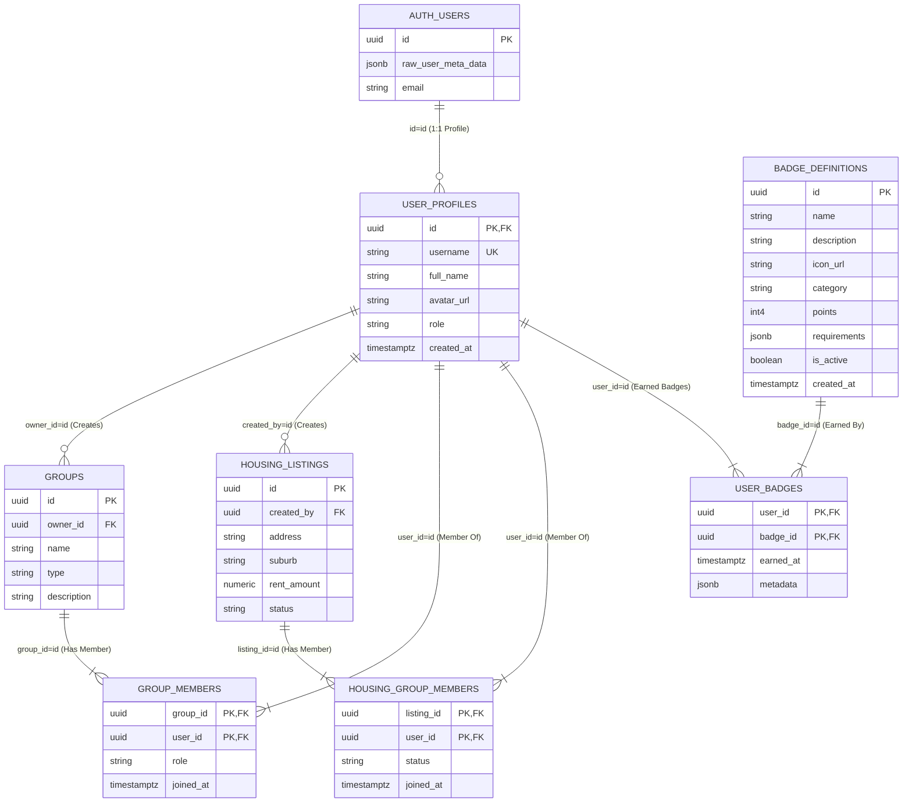

# Rollodex Application Database Schema (Supabase/PostgreSQL)

## Overview

This document describes the structure of the public schema tables used by the Rollodex application, focusing on user profiles, standard groups, housing listings, and co-living housing groups. It outlines key tables, relationships, and recent automation improvements.

**Schema State:** The `user_profiles` table adheres to the standard Supabase pattern where its `id` column serves as both the Primary Key (PK) and the Foreign Key (FK) directly referencing `auth.users.id`. This simplifies relationships and queries throughout the application.

**Note:** A visual diagram (e.g., using Mermaid syntax or a tool like dbdiagram.io) would complement this textual description for better understanding relationships.

## Recent Changes & Confirmations (April 2025)

*   **Automated User Profile Creation & Username Generation:**
    *   A PostgreSQL function (`public.create_profile_for_new_user`) and a trigger (`on_auth_user_created` on `auth.users`) were implemented.
    *   **Purpose:** When a new user signs up via Supabase Auth, the trigger executes the function to automatically create a corresponding entry in `public.user_profiles`.
    *   **Details:** The function extracts `full_name` and `avatar_url` from `auth.users.raw_user_meta_data`, generates a unique `username` (base name + random suffix), and inserts the profile using the `auth.users.id` as the `user_profiles.id`.
*   **`user_profiles` Structure Confirmation:**
    *   Confirmed the `user_profiles` table uses `id uuid` as its primary key, which also directly references `auth.users(id)` via the `fk_user_profiles_auth_users` foreign key constraint (with `ON DELETE CASCADE`). This aligns with best practices.

## Schema Diagram (Mermaid)

## Core Tables and Columns

### 1. `auth.users` (Supabase Internal)

*   Managed by Supabase Authentication.
*   Contains core authentication details.
*   **Key Columns:**
    *   `id uuid` (Primary Key): The unique identifier for the authenticated user.
    *   `email text`: User's email.
    *   `raw_user_meta_data jsonb`: Stores custom user data provided during signup/update (e.g., `full_name`, `avatar_url`).

### 2. `public.user_profiles`

*   Stores public-facing and application-specific user information, extending `auth.users`.
*   Created automatically via the `on_auth_user_created` trigger.
*   **Key Columns:**
    *   `id uuid` (Primary Key, **Foreign Key to `auth.users.id` ON DELETE CASCADE**): Links directly to the authenticated user. This is the central identifier.
    *   `username text` (Unique): Automatically generated, user-facing identifier.
    *   `full_name text`: User's display name.
    *   `avatar_url text`: URL to the user's profile picture.
    *   `bio text`: User's biography/description.
    *   `role text`: User role within the application (e.g., 'user', 'admin').
    *   `ndis_number text`, `ndis_verified boolean`: NDIS specific fields.
    *   `comfort_traits text[]`, `preferred_categories text[]`, `preferred_service_formats text[]`, `accessibility_needs text[]`: Arrays for user preferences and needs.
    *   `created_at timestamptz`, `updated_at timestamptz`: Timestamps for record management.

### 3. `public.groups`

*   Represents standard community groups.
*   **Key Columns:**
    *   `id uuid` (Primary Key)
    *   `owner_id uuid` (**Foreign Key to `user_profiles.id` ON DELETE SET NULL**): The user who created/owns the group.
    *   `name text`
    *   `description text`
    *   `type text` (e.g., 'community', 'housing_co_living')
    *   `visibility text` (e.g., 'public', 'private')
    *   `created_at timestamptz`

### 4. `public.group_members`

*   Junction table linking users to the groups they are members of.
*   **Key Columns:**
    *   `group_id uuid` (**Foreign Key to `groups.id` ON DELETE CASCADE**)
    *   `user_id uuid` (**Foreign Key to `user_profiles.id` ON DELETE CASCADE**): References the member user.
    *   `role text` (e.g., 'member', 'admin', 'moderator')
    *   `joined_at timestamptz`
    *   (Composite Primary Key: `group_id`, `user_id`)

### 5. `public.housing_listings`

*   Represents available housing options.
*   **Key Columns:**
    *   `id uuid` (Primary Key)
    *   `created_by uuid` (**Foreign Key to `user_profiles.id` ON DELETE SET NULL**): User who posted the listing.
    *   `address text`, `suburb text`, `state text`, `postcode text`
    *   `rent_amount numeric`, `rent_frequency text`
    *   `description text`
    *   `property_features text[]`, `accessibility_features text[]`
    *   `images text[]`
    *   `status text` (e.g., 'available', 'leased')
    *   `created_at timestamptz`, `updated_at timestamptz`

### 6. `public.housing_group_members`

*   Junction table specifically linking users (potential tenants) to housing listings they are interested in or part of a group for.
*   **Key Columns:**
    *   `listing_id uuid` (**Foreign Key to `housing_listings.id` ON DELETE CASCADE**)
    *   `user_id uuid` (**Foreign Key to `user_profiles.id` ON DELETE CASCADE**)
    *   `status text` (e.g., 'interested', 'applied', 'accepted')
    *   `joined_at timestamptz`
    *   (Composite Primary Key: `listing_id`, `user_id`)

### 7. `public.badge_definitions`

*   Stores the master list and properties of all badges that can potentially be awarded.
*   **Key Columns:**
    *   `id uuid` (Primary Key): Unique identifier for each badge definition.
    *   `name text`: The human-readable name of the badge (e.g., "Pioneer", "Community Helper").
    *   `description text`: A description explaining what the badge is for or how it is earned.
    *   `icon_url text` (Nullable): URL pointing to an image/icon representing the badge.
    *   `category text`: A category to group badges (e.g., "Participation", "Achievement", "Skill").
    *   `points int4`: Optional points awarded to the user when this badge is earned.
    *   `requirements jsonb`: JSON object defining the specific criteria needed to earn the badge.
    *   `is_active boolean` (Default: `true`): Flag indicating if this badge is currently active and can be earned.
    *   `created_at timestamptz` (Nullable): Timestamp indicating when this badge definition was created.

### 8. `public.user_badges`

*   Junction table tracking which users have earned which badges.
*   **Key Columns:**
    *   `user_id uuid` (**Foreign Key to `user_profiles.id` ON DELETE CASCADE**): The user who earned the badge.
    *   `badge_id uuid` (**Foreign Key to `badge_definitions.id` ON DELETE CASCADE**): The badge that was earned.
    *   `earned_at timestamptz` (Default: `NOW()`): Timestamp when the badge was awarded.
    *   `metadata jsonb` (Nullable): Optional extra data about the specific instance of earning the badge.
    *   (Composite Primary Key: `user_id`, `badge_id`)

### Other Supporting Tables (Examples)

*   `subgroups`: For sub-sections within main groups.
    *   `created_by uuid` (FK to `user_profiles.id`)
*   `group_posts`, `group_post_comments`, `group_post_reactions`: For group discussions.
    *   `user_id` or `author_id` (FK to `user_profiles.id`)
*   `group_events`, `group_event_participants`: For group events.
    *   `created_by` or `user_id` (FK to `user_profiles.id`)
*   `group_invites`: For inviting users to groups.
    *   `inviter_id`, `invitee_id` (FKs to `user_profiles.id`)
*   `user_relationships`: For tracking connections between users (e.g., friends).
    *   `requester_id`, `addressee_id` (FKs to `user_profiles.id`)

## Key Relationships & Constraints Summary

*   **User Identity:** The core link is `auth.users.id` -> `user_profiles.id`. All other tables referencing a user should use a foreign key pointing to `public.user_profiles.id`.
*   **Group Membership:** `groups` <- `group_members` -> `user_profiles`.
*   **Housing Listing Ownership:** `housing_listings` -> `user_profiles` (via `created_by`).
*   **Housing Group Membership:** `housing_listings` <- `housing_group_members` -> `user_profiles`.
*   **Badge Earning:** `badge_definitions` <- `user_badges` -> `user_profiles`.
*   **Group Activities:** Tables like `group_posts`, `group_events`, etc., link back to `groups` and `user_profiles`.
*   **Referential Integrity:** Foreign Key constraints use `ON DELETE CASCADE` or `ON DELETE SET NULL` based on logical requirements (review specific constraints in the table definitions above or using SQL introspection).
    *   `CASCADE`: Deleting a user typically deletes their memberships, reactions, comments, relationships, invites. Deleting a group or listing deletes associated memberships/posts.
    *   `SET NULL`: Deleting a user might set the `owner_id` or `created_by` in `groups`, `housing_listings`, `group_events` to `NULL` to preserve the content without the original user link.

## Areas for Potential Future Improvement

1.  **Indexing:** Review indexing strategies for performance, especially on columns used in `WHERE` clauses and `JOIN` conditions (e.g., `username` in `user_profiles`, `status` fields, FK columns).
2.  **RLS Policy Granularity:** Ensure Row Level Security policies are correctly implemented and sufficiently granular for all tables, especially considering the standardized `user_profiles.id` linkage.
3.  **Data Validation:** Implement stricter check constraints or use domain types where appropriate (e.g., for `status`, `visibility`, `role` fields) to ensure data consistency.
4.  **Documentation:** Consider generating a visual schema diagram.

## Database State Summary & Relationships

The database now automatically handles user profile creation and basic username assignment upon signup, streamlining the user onboarding flow.

**Key Entities & Relationships:**

1.  **Users (`auth.users` & `user_profiles`):**
    *   Authentication is handled by Supabase's `auth.users`.
    *   Public profile details are in `user_profiles`.
    *   A trigger ensures a `user_profiles` record is created for every new `auth.users` record.
    *   **Standardized Structure:** `user_profiles.id` is both the PK and the FK referencing `auth.users.id`, simplifying queries and relationships.

2.  **Community Groups (`groups` & `group_members`):**
    *   `groups` define general interest groups.
    *   `groups.owner_id` links back to the creating user via `auth.users.id`.
    *   `group_members` is the many-to-many link between `groups` (`group_id`) and users (`user_id`, linking to `auth.users.id`).

3.  **Housing (`housing_listings`, `housing_groups`, `housing_group_members`):**
    *   `housing_listings` represent individual properties, typically linked to a `service_providers` table (assumed).
    *   `housing_groups` represent co-living arrangements tied to *one specific* `housing_listings` (`listing_id` FK).
    *   `housing_groups.creator_id` links back to the creating user via `auth.users.id`.
    *   `housing_group_members` is the many-to-many link between `housing_groups` (`group_id`) and users (`user_id`, linking to `auth.users.id`).
    *   A `housing_listings` record can have *zero or one* associated `housing_groups` (via the `listing_id` FK in `housing_groups`).
    *   A `housing_listings` record can have its `has_group_match` flag set to `true` if a corresponding `housing_groups` record exists.

4.  **Badges (`badge_definitions` & `user_badges`):**
    *   `badge_definitions` stores the master list of badges.
    *   `user_badges` tracks which users have earned which badges.

**Navigation Summary:**

*   **Find all community groups a user (`auth_user_id`) is in:**
    `SELECT g.* FROM groups g JOIN group_members gm ON g.id = gm.group_id WHERE gm.user_id = auth_user_id;`
*   **Find all members (and their profiles) of a specific community group (`group_id`):**
    `SELECT up.* FROM user_profiles up JOIN auth.users au ON up.id = au.id JOIN group_members gm ON au.id = gm.user_id WHERE gm.group_id = group_id;`
*   **Find the co-living group associated with a housing listing (`listing_id`):**
    `SELECT * FROM housing_groups WHERE listing_id = listing_id;` (Returns 0 or 1 row).
*   **Find all members (and their profiles) of a specific co-living housing group (`housing_group_id`):**
    `SELECT up.* FROM user_profiles up JOIN auth.users au ON up.id = au.id JOIN housing_group_members hgm ON au.id = hgm.user_id WHERE hgm.group_id = housing_group_id;`
*   **Find all co-living housing groups a user (`auth_user_id`) is in:**
    `SELECT hg.* FROM housing_groups hg JOIN housing_group_members hgm ON hg.id = hgm.group_id WHERE hgm.user_id = auth_user_id;`
*   **Find all badges earned by a user (`user_id`):**
    `SELECT bd.* FROM badge_definitions bd JOIN user_badges ub ON bd.id = ub.badge_id WHERE ub.user_id = user_id;`

## Identified Issues & Areas for Improvement

1.  **Indexing:** Review indexing strategies for performance, especially on columns used in `WHERE` clauses and `JOIN` conditions (e.g., `username` in `user_profiles`, `status` fields, FK columns).
2.  **RLS Policy Granularity:** Ensure Row Level Security policies are correctly implemented and sufficiently granular for all tables, especially considering the standardized `user_profiles.id` linkage.
3.  **Data Validation:** Implement stricter check constraints or use domain types where appropriate (e.g., for `status`, `visibility`, `role` fields) to ensure data consistency.
4.  **Documentation:** Consider generating a visual schema diagram.

## Summary of Schema State

The schema now automates user profile creation, improving user experience. The standardized structure of `user_profiles` simplifies relationships and queries, leveraging Supabase features more effectively. The relationships between users, community groups, housing listings, and housing groups are functional and well-defined.